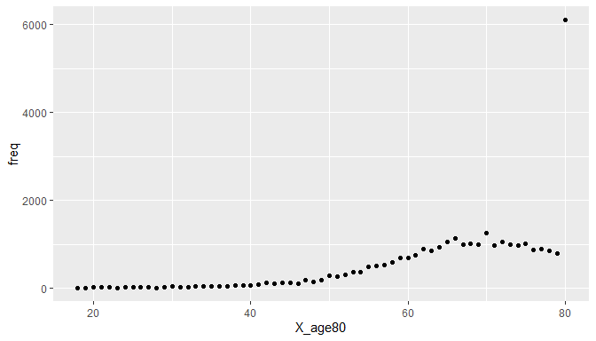
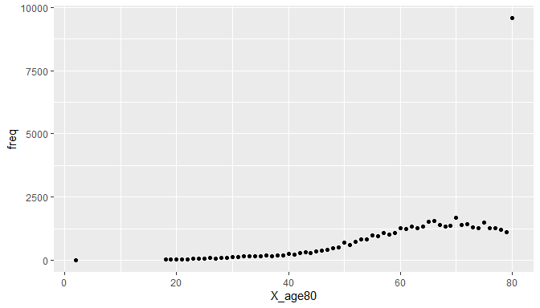
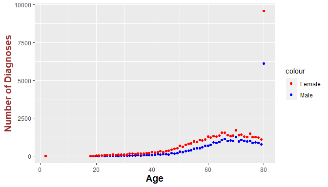
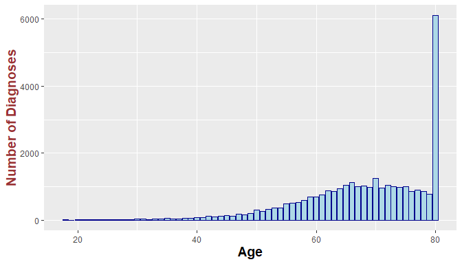
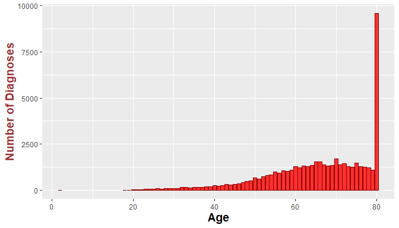
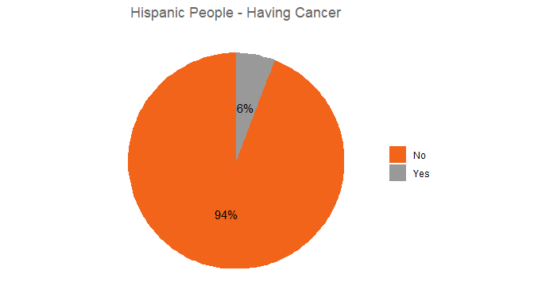
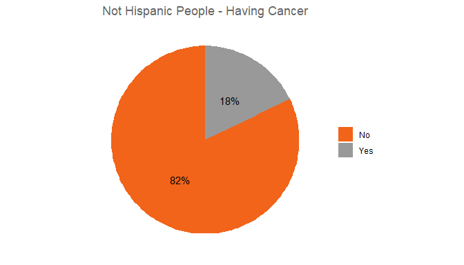
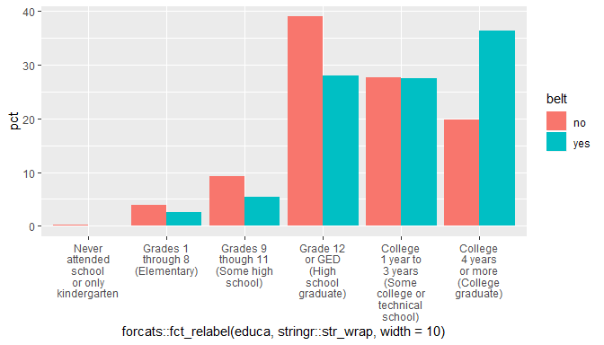
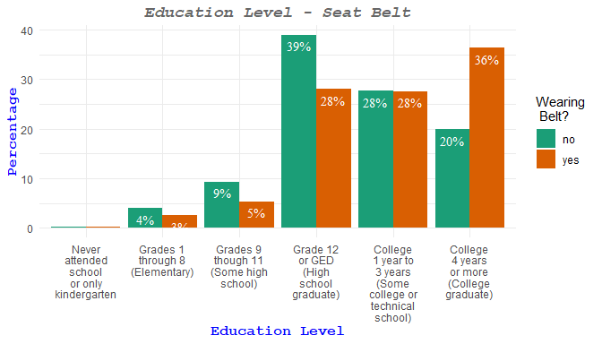

## Setup

### Load packages


```r
library(ggplot2)
library(dplyr)
```

### Load data


```r
load("brfss2013.RData")
```


* * *

## Part 1: Data

  While gathering data for BRFSS, participants have chosen randomly and surveyed by telephone. Because of that random choosing, we can say random sampling was used. So, all the data that gathered can be generalizable to the population. Besides that, before 2013, only adult people surveyed, so we can say our population is only adults.
  
  However, since there is no experiment or experimental-control groups in BFFS -only survey-, we can say that there is no place for random assignment.


* * *

## Part 2: Research questions

**Research question 1:**

  Is there a correlation between having a cancer and age among males and females? It can be interesting to see the cancer distribution of patients' age and role of the gender factor.

**Research question 2:**

  Are Hispanic, Latino/a, or Spanish origin people less tend to be diagnosed with cancer? Also there could be a link with patients' gender. Saw an article about this topic recently and it could be interesting to see the results. (https://www.usatoday.com/story/news/2018/09/29/hispanic-health/1442099002/)

**Research question 3:**
      
  Is there a correlation between education level and wearing seat belt? Specially, in small ages, school can be an important teaching place for life too. Does it really have an impact on kids?

* * *

## Part 3: Exploratory data analysis


**Research question 1:**
          
    Is there a correlation between having a cancer and age among males and females?

  First gather required data from the dataset. For this question we need 4 variables : 
    
    
*chcscncr: (Ever Told) You Had Skin Cancer?*

*chcocncr: (Ever Told) You Had Any Other Types Of Cancer?*

*X_age80: Imputed Age Value Collapsed Above 80*

*sex: Respondents Sex*


  After that, create a new variable "isCancer" to deal with only one variable : 
  

```r
brfss2013 <- brfss2013 %>% mutate(isCancer = ifelse(chcocncr=="Yes" | chcscncr =="Yes", "Yes","No"))
```

  Then collect data for both genders: 


```r
  male_cancer_age = brfss2013 %>% group_by(X_age80) %>% 
    filter(sex=="Male", isCancer=="Yes", !is.na(X_age80)) %>%
    summarise(freq = n())
  
  male_cancer_age
```

```
## # A tibble: 63 x 2
##    X_age80  freq
##      <int> <int>
##  1      18    15
##  2      19    10
##  3      20    18
##  4      21    18
##  5      22    19
##  6      23    15
##  7      24    23
##  8      25    22
##  9      26    27
## 10      27    28
## # ... with 53 more rows
```

```r
  female_cancer_age = brfss2013 %>% group_by(X_age80) %>%
    filter(sex=="Female", isCancer=="Yes", !is.na(X_age80)) %>%
    summarise(freq = n())
  
  female_cancer_age
```

```
## # A tibble: 64 x 2
##    X_age80  freq
##      <int> <int>
##  1       2     1
##  2      18    13
##  3      19    16
##  4      20    23
##  5      21    33
##  6      22    37
##  7      23    53
##  8      24    61
##  9      25    56
## 10      26    97
## # ... with 54 more rows
```

  After finishing and storing corresponding data for the question, next step is the calculating the summary statistics. 
  For this purpose, order the both male and female datasets by frequencies.
  

```r
  sorted_male <- male_cancer_age[order(male_cancer_age$freq),]
  sorted_female <- female_cancer_age[order(female_cancer_age$freq),]
```


```r
str(sorted_male)
```

```
## Classes 'tbl_df', 'tbl' and 'data.frame':	63 obs. of  2 variables:
##  $ X_age80: int  19 18 23 28 20 21 22 25 24 26 ...
##  $ freq   : int  10 15 15 17 18 18 19 22 23 27 ...
```

```r
str(sorted_female)
```

```
## Classes 'tbl_df', 'tbl' and 'data.frame':	64 obs. of  2 variables:
##  $ X_age80: int  2 18 19 20 21 22 23 25 24 27 ...
##  $ freq   : int  1 13 16 23 33 37 53 56 61 71 ...
```

Then, get the summary statistics:


```r
  summary(sorted_female)
```

```
##     X_age80           freq       
##  Min.   : 2.00   Min.   :   1.0  
##  1st Qu.:32.75   1st Qu.: 147.5  
##  Median :48.50   Median : 496.5  
##  Mean   :48.27   Mean   : 797.1  
##  3rd Qu.:64.25   3rd Qu.:1262.2  
##  Max.   :80.00   Max.   :9593.0
```

```r
  summary(sorted_male)
```

```
##     X_age80          freq       
##  Min.   :18.0   Min.   :  10.0  
##  1st Qu.:33.5   1st Qu.:  43.5  
##  Median :49.0   Median : 196.0  
##  Mean   :49.0   Mean   : 501.3  
##  3rd Qu.:64.5   3rd Qu.: 866.0  
##  Max.   :80.0   Max.   :6108.0
```

  At this point, it can be seen that, since there are some extreme values in female dataset, range and the skewness of the dataset is much bigger than male dataset. Other than that almost there is no difference between these two datasets. 
  
  To ensure this, see the closest ages of both genders to the median value.
  

```r
  sorted_female[[1]][which.min(abs(sorted_female$freq - 496.5))]
```

```
## [1] 48
```

```r
  sorted_male[[1]][which.min(abs(sorted_male$freq - 196.0))]
```

```
## [1] 49
```
  
  Median age of being diagnosed with cancer is almost identical for both genders. 


After finishing with summary statistics, last step is the visualization of the data. For this purpose single scatter plot is the best choice. 
    But first, create two seperate plots for both genders:
    

```r
  ggplot(male_cancer_age, aes(x=X_age80, y=freq)) + geom_point()
```

<!-- -->
    

```r
  ggplot(female_cancer_age, aes(x=X_age80, y=freq)) + geom_point()
```

<!-- -->

  Then combine these two plots into a single scatter plot:
  

```r
  combine <- ggplot(male_cancer_age, aes(X_age80, freq)) + geom_point(aes(colour = "Male")) + 
    geom_point(data = female_cancer_age, aes(colour = "Female")) + 
    scale_colour_manual(values = c("red", "blue"))
  print(combine)
```

<!-- -->
  
  Finally, after some visual changes we're done.
  

```r
combine <- combine + labs(x = "Age", y = "Number of Diagnoses")
combine + theme(
axis.title.x = element_text(color = "black", size = 14, face = "bold"),
axis.title.y = element_text(color = "#993333", size = 14, face = "bold")
)
```

<!-- -->
  
  Other than scatter plot, histogram can be good choice also : 
  

```r
  m <- ggplot(male_cancer_age, aes(x=X_age80, y = freq)) + geom_col(color="darkblue", fill="lightblue")
  m <- m + labs(x = "Age", y = "Number of Diagnoses")
  m + theme(
axis.title.x = element_text(color = "black", size = 14, face = "bold"),
axis.title.y = element_text(color = "#993333", size = 14, face = "bold")
)
```

<!-- -->


```r
  m <- ggplot(female_cancer_age, aes(x=X_age80, y = freq)) + geom_col(color="darkred", fill="firebrick1")
  m <- m + labs(x = "Age", y = "Number of Diagnoses")
  m + theme(
axis.title.x = element_text(color = "black", size = 14, face = "bold"),
axis.title.y = element_text(color = "#993333", size = 14, face = "bold")
)
```

<!-- -->
  
  With both plots we can easily see the same results. 
  
  * After age of 50, there is a huge increase of the risk of cancer
  * Gender isn't a significant factor in cancer. 
  * There is a huge difference between age of 80 and before 80. A person is more likely to be diagnosed with a cancer after age of 80.
  
**Research question 2:**

    Are Hispanic, Latino/a, or Spanish origin people less tend to be diagnosed with cancer? Also there could be a link with patients' gender.

  First gather required data from the dataset. For this question we need 4 variables : 
  

*X_hispanc: Hispanic, Latino/A, Or Spanish Origin Calculated Variable*

*chcscncr: (Ever Told) You Had Skin Cancer?*

*chcocncr: (Ever Told) You Had Any Other Types Of Cancer?*

(Instead of these two, will use "isCancer" variable which created in previous question)

*sex: Respondents Sex*
  


  Find the total number of Hispanic and not Hispanic people: 


```r
  brfss2013 %>% group_by(X_hispanc) %>% 
    filter(!is.na(X_hispanc)) %>% summarise(freq = n())
```

```
## # A tibble: 2 x 2
##   X_hispanc                                      freq
##   <fct>                                         <int>
## 1 Hispanic, Latino/a, or Spanish origin         37062
## 2 Not of Hispanic, Latino/a, or Spanish origin 449274
```

  Then, find the number of people who diagnosed with cancer among these 2 groups : 
  

```r
  brfss2013 %>% group_by(X_hispanc) %>% 
    filter(isCancer =="Yes", !is.na(X_hispanc)) %>% summarise(freq = n())
```

```
## # A tibble: 2 x 2
##   X_hispanc                                     freq
##   <fct>                                        <int>
## 1 Hispanic, Latino/a, or Spanish origin         2141
## 2 Not of Hispanic, Latino/a, or Spanish origin 79743
```

  To see is there difference between Hispanic and not-Hispanic people about cancer, see the ratio of among two groups : 
  

```r
2141 / 37062
```

```
## [1] 0.05776806
```

```r
79743 / 449274
```

```
## [1] 0.177493
```
  
  Ratio for the not-Hispanic people is 3 times more. We can say that Hispanic people are 3 times less likely to be diagnosed with cancer. But continue to see that is there link with gender factor too. 
  
  First, start with females : 
  

```r
  brfss2013 %>% group_by(X_hispanc) %>% 
    filter(sex=="Female", !is.na(X_hispanc)) %>% summarise(freq = n())
```

```
## # A tibble: 2 x 2
##   X_hispanc                                      freq
##   <fct>                                         <int>
## 1 Hispanic, Latino/a, or Spanish origin         21775
## 2 Not of Hispanic, Latino/a, or Spanish origin 265775
```

```r
  brfss2013 %>% group_by(X_hispanc) %>% 
    filter(sex=="Female", isCancer =="Yes", !is.na(X_hispanc)) %>% summarise(freq = n())
```

```
## # A tibble: 2 x 2
##   X_hispanc                                     freq
##   <fct>                                        <int>
## 1 Hispanic, Latino/a, or Spanish origin         1442
## 2 Not of Hispanic, Latino/a, or Spanish origin 49166
```
    
  Ratio for females : 
  

```r
  1442 / 21775
```

```
## [1] 0.06622273
```

```r
  49166 / 265775
```

```
## [1] 0.1849911
```
  
  It is almost the same (3 times) result with the overall ratio. 
  
  And males : 
  

```r
  brfss2013 %>% group_by(X_hispanc) %>% 
    filter(sex=="Male", !is.na(X_hispanc)) %>% summarise(freq = n())
```

```
## # A tibble: 2 x 2
##   X_hispanc                                      freq
##   <fct>                                         <int>
## 1 Hispanic, Latino/a, or Spanish origin         15287
## 2 Not of Hispanic, Latino/a, or Spanish origin 183499
```

```r
  brfss2013 %>% group_by(X_hispanc) %>% 
    filter(sex=="Male", isCancer =="Yes", !is.na(X_hispanc)) %>% summarise(freq = n())
```

```
## # A tibble: 2 x 2
##   X_hispanc                                     freq
##   <fct>                                        <int>
## 1 Hispanic, Latino/a, or Spanish origin          699
## 2 Not of Hispanic, Latino/a, or Spanish origin 30577
```
  

```r
699 / 15287
```

```
## [1] 0.04572513
```

```r
30577 / 183499
```

```
## [1] 0.1666331
```
  
  Again it is very close to the other results. We can say that gender is not a significant factor. 
  
  See this results in pie charts :
  

```r
  h1 <- brfss2013 %>% group_by(isCancer) %>% 
    filter(X_hispanc == "Hispanic, Latino/a, or Spanish origin", !is.na(X_hispanc), !is.na(isCancer)) %>% 
    summarise(freq = n()) %>% mutate(pct = freq/sum(freq) * 100)
  
  pie = ggplot(h1, aes(x="", y=pct/100, fill=isCancer)) + geom_bar(stat="identity", width=1)
  
  pie = pie + coord_polar("y", start=0) + 
    geom_text(aes(label = paste0(round(pct), "%")), position = position_stack(vjust = 0.5))
  
  pie = pie + scale_fill_manual(values=c("#F26419", "#999999"))
  
  pie = pie + labs(x = NULL, y = NULL, fill = NULL, title = "Hispanic People - Having Cancer")
  
  pie = pie + theme_classic() + theme(axis.line = element_blank(),
    axis.text = element_blank(),
    axis.ticks = element_blank(),
    plot.title = element_text(hjust = 0.5, color = "#666666"))
  
  print(pie)
```

<!-- -->


```r
  h2 <- brfss2013 %>% group_by(isCancer) %>% 
    filter(X_hispanc == "Not of Hispanic, Latino/a, or Spanish origin", !is.na(X_hispanc), !is.na(isCancer)) %>% 
    summarise(freq = n()) %>% mutate(pct = freq/sum(freq) * 100)
  
  pie = ggplot(h2, aes(x="", y=pct/100, fill=isCancer)) + geom_bar(stat="identity", width=1)
  
  pie = pie + coord_polar("y", start=0) + 
    geom_text(aes(label = paste0(round(pct), "%")), position = position_stack(vjust = 0.5))
  
  pie = pie + scale_fill_manual(values=c("#F26419", "#999999"))
  
  pie = pie + labs(x = NULL, y = NULL, fill = NULL, title = "Not Hispanic People - Having Cancer")
  
  pie = pie + theme_classic() + theme(axis.line = element_blank(),
    axis.text = element_blank(),
    axis.ticks = element_blank(),
    plot.title = element_text(hjust = 0.5, color = "#666666"))
  
  print(pie)
```

<!-- -->
  
  - Having hispanic genes have an impact on having cancer.
  - However, gender isn't a factor other than genetics.
  - Reason of this result may not be general to the all Hispanic people around the world.
  - Hispanic people who live in U.S., may have different life conditions than other contries' Latino people.
  

**Research question 3:**

     Is there a correlation between education level and wearing seat belt?

First gather required data from the dataset. For this question we need 2 variables :


*X_rfseat2: Always or Nearly Always Wear Seat Belts Calculated Variable*

*educa: What is the highest grade or year of school you completed?*


```r
combine <- brfss2013 %>% group_by(X_rfseat2, educa) %>% filter(!is.na(X_rfseat2),!is.na(educa)) %>% 
summarise(count=n()) %>% mutate(pct = count / sum(count) * 100)

combine <- combine %>% mutate(belt = ifelse(X_rfseat2 == "Always or almost always wear seat belt", "yes", "no"))
print(combine)
```

```
## # A tibble: 12 x 5
## # Groups:   X_rfseat2 [2]
##    X_rfseat2               educa                         count    pct belt 
##    <fct>                   <fct>                         <int>  <dbl> <chr>
##  1 Always or almost alway~ Never attended school or on~    528  0.124 yes  
##  2 Always or almost alway~ Grades 1 through 8 (Element~  10894  2.56  yes  
##  3 Always or almost alway~ Grades 9 though 11 (Some hi~  22655  5.33  yes  
##  4 Always or almost alway~ Grade 12 or GED (High schoo~ 119184 28.0   yes  
##  5 Always or almost alway~ College 1 year to 3 years (~ 117170 27.6   yes  
##  6 Always or almost alway~ College 4 years or more (Co~ 154483 36.4   yes  
##  7 Sometimes, seldom, or ~ Never attended school or on~     52  0.194 no   
##  8 Sometimes, seldom, or ~ Grades 1 through 8 (Element~   1053  3.93  no   
##  9 Sometimes, seldom, or ~ Grades 9 though 11 (Some hi~   2499  9.33  no   
## 10 Sometimes, seldom, or ~ Grade 12 or GED (High schoo~  10442 39.0   no   
## 11 Sometimes, seldom, or ~ College 1 year to 3 years (~   7426 27.7   no   
## 12 Sometimes, seldom, or ~ College 4 years or more (Co~   5324 19.9   no
```

See this results better with a bar chart : 


```r
p = ggplot(combine, aes(x=forcats::fct_relabel(educa,stringr::str_wrap, width = 10), y = pct, fill=belt)) + 
  geom_col(position=position_dodge())
print(p)
```

<!-- -->

Put percentages on chart and add chart title with legend: 


```r
p = p + geom_text(aes(label=paste0(round(pct), "%"), family = "serif"), vjust=1.6, color="white",
                  position = position_dodge(0.9), size=4.0) + 
  theme_minimal() + 
  scale_fill_brewer(palette="Dark2") + 
  labs(title = "Education Level - Seat Belt", fill = "Wearing \n Belt?")
print(p)
```

<!-- -->

Lastly customize the theme and add axis titles : 


```r
p = p + theme(
  plot.title = element_text(family = "mono", face="bold.italic", hjust = 0.5, color = "#666666"), 
  axis.title.x = element_text(family = "mono", color="blue", size=12, face="bold"), 
  axis.title.y = element_text(family = "mono", color="blue", size=12, face="bold")
              ) + xlab("Education Level") + ylab("Percentage")
print(p)
```

<!-- -->

To sum up:

 - When education level going up, people are more tend to wear seat belts.
 - However, among High School graduates, not wearing seat belts is more popular. 
 - It is very clear that wearing seat belt percentages are going up with education level.
 - This means that, educated people are more aware of the consequences of not wearing seat belts.
