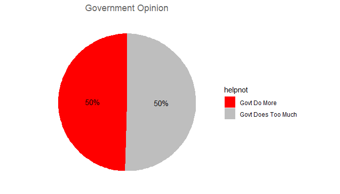
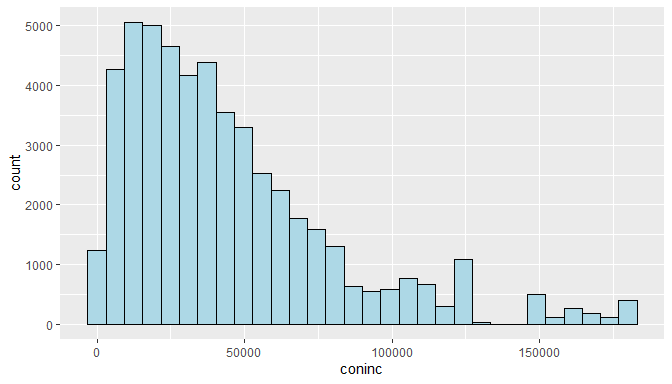

## Setup

### Load packages


```r
library(ggplot2)
library(dplyr)
library(statsr)
```

### Load data


```r
load("gss.Rdata")
```


* * *

## Part 1: Data

The vast majority of GSS data is obtained in face-to-face interviews and participants have chosen randomly. Because of that random choosing, we can say random sampling was used. So, all the data that gathered can be generalizable to the population.

However, since there is no experiment or experimental-control groups in GSS -only survey-, we can say that there is no place for random assignment.


* * *

## Part 2: Research question

My research question is, is there a relationship between the family income of a person and person's government opinions. More specifically, I will investigate the variables **HELPNOT**(SHOULD GOVT DO MORE OR LESS?) and **CONINC**(FAMILY INCOME IN CONSTANT DOLLARS). 

It will be interesting to see, do people really have objective opinions about governments or their own life-style shadows their opinions?


* * *

## Part 3: Exploratory data analysis

**Research question:**
    
    Is there a correlation between HELPNOT(SHOULD GOVT DO MORE OR LESS?) and CONINC(FAMILY INCOME IN CONSTANT DOLLARS)
    
First, investigate these variables ; 


```r
gov_opinion = gss %>% group_by(helpnot) %>% 
    filter(!is.na(helpnot)) %>% 
    summarise(freq = n())

gov_opinion
```

```
## # A tibble: 3 x 2
##   helpnot             freq
##   <fct>              <int>
## 1 Govt Do More        4061
## 2 Agree With Both    10874
## 3 Govt Does Too Much  4137
```

When we extract the people with middle opinion (Agree With Both), we almost have equal number of people for both sides. It is 4061 vs 4137. This can give us more precise results which is good.


```r
govt_op_dist <- gss %>% group_by(helpnot) %>% 
    filter(helpnot != "Agree With Both", !is.na(helpnot)) %>% 
    summarise(freq = n()) %>% mutate(pct = freq/sum(freq) * 100)
  
  pie = ggplot(govt_op_dist, aes(x="", y=pct/100, fill=helpnot)) + geom_bar(stat="identity", width=1)
  
  pie = pie + coord_polar("y", start=0) + 
    geom_text(aes(label = paste0(round(pct), "%")), position = position_stack(vjust = 0.5))
  
  pie = pie + scale_fill_manual(values=c("red", "grey"))
  
  pie = pie + labs(x = NULL, y = NULL, title = "Government Opinion")
  
  pie = pie + theme_classic() + theme(axis.line = element_blank(),
    axis.text = element_blank(),
    axis.ticks = element_blank(),
    plot.title = element_text(hjust = 0.5, color = "#666666"))
  
  print(pie)
```

<!-- -->

Now, let's investigate the other variable, family income level. 


```r
family_income = gss %>% group_by(coninc) %>% 
    filter(!is.na(coninc)) %>% 
    summarise(freq = n())

family_income
```

```
## # A tibble: 547 x 2
##    coninc  freq
##     <int> <int>
##  1    383    24
##  2    402    43
##  3    415    20
##  4    441    43
##  5    468    42
##  6    486    39
##  7    517    30
##  8    535    36
##  9    561    26
## 10    587    23
## # … with 537 more rows
```

See the distribution of the values in a graph:


```r
p <- ggplot(gss, aes(x=coninc)) + 
  geom_histogram(color="black", fill="lightblue")
p
```

```
## `stat_bin()` using `bins = 30`. Pick better value with `binwidth`.
```

<!-- -->

Unlike the other variable, helpnot, this variable has a non-normal distribution and right-skewed. Also it includes numbers from a very wide range.

Let's calculate the summary statistics of this variable.


```r
summary(family_income$coninc)
```

```
##    Min. 1st Qu.  Median    Mean 3rd Qu.    Max. 
##     383    8275   20358   32627   43894  180386
```

And standard deviation is:


```r
sd(family_income$coninc)
```

```
## [1] 34636.72
```

Now let's see the mean and standard deviation values for each opinion group


```r
family_income_both = gss %>% group_by(helpnot) %>% 
    filter(!is.na(helpnot)) %>% 
    summarise(count = n(), mean = mean(coninc, na.rm = TRUE), sd = sd(coninc, na.rm = TRUE))

family_income_both
```

```
## # A tibble: 3 x 4
##   helpnot            count   mean     sd
##   <fct>              <int>  <dbl>  <dbl>
## 1 Govt Do More        4061 33281. 30505.
## 2 Agree With Both    10874 44050. 35393.
## 3 Govt Does Too Much  4137 52161. 39619.
```

Finally, save these values in a dataframe :


```r
opinions <- c('govt should do more','govt does too much')
opinions <- c('govt should do more','govt does too much')
```


* * *

## Part 4: Inference

My hypothesis for this project is : 

**Income level of people who think that "government in Washington is trying to do too many things that should be left to individuals and private busienss" is higher than people who think "government should do even more to solve country's problems".**

For this purpose I will use two variables; *helpnot* and *coninc* which I investigated previously.

x ---> average family income of the corresponding opinion group.

> H~0~ : x~govtdoestoomuch~ = x~govtshoulddomore~

Null hypotehesis says, there is nothing unusual going on, average family income of both opinion groups is equal.

> H~A~ : x~govtdoestoomuch~ != x~govtshoulddomore~

Alternative hypotehesis says, there is something going on, average family income is not equal for both opinion groups.

First, check the conditions : 

**1 - Independence**

Have to look for both within and between the groups.

Since, this survey conducted via face-to-face interviews and participants have chosen randomly, we can verify these indepence conditions. 

**2 - Sample Size / Skew**

Both of our opinion groups have close number of people, so this condition is met too.


Now, will try to make a statistical inference with comparing two independent means using t-score. For this purpose, Confidence Interval will be used.

Confidence interval formula is :

$$CI = (x_1 − x_2) ± t ⋆ dfSE$$

standard error : 

$$SE = \sqrt{\frac{s_1^2}{n_1} + \frac{s_2^2}{n_2}}$$

degrees of freedom : 

$$df = min(n_1 - 1, n_2 - 1)$$

These are the all formulas needed. Start with degrees of freedom ;


```r
family_income_both = gss %>% group_by(helpnot) %>% 
    filter(!is.na(helpnot)) %>% 
    summarise(count = n(), mean = mean(coninc, na.rm = TRUE), sd = sd(coninc, na.rm = TRUE))

family_income_both
```

```
## # A tibble: 3 x 4
##   helpnot            count   mean     sd
##   <fct>              <int>  <dbl>  <dbl>
## 1 Govt Do More        4061 33281. 30505.
## 2 Agree With Both    10874 44050. 35393.
## 3 Govt Does Too Much  4137 52161. 39619.
```

Using this table; $$n_1 = 4061$$ and $$n_2 = 4137$$

$$df = min(4060, 4136) = 4060$$

Now, we have degrees of freedom value. Next step is to calculate the T score and critical value. Will use %95 confidence interval. Since our hypothesis are equal and not equal, two tail area is what is needed : 


```r
qt(0.025, df = 4060)
```

```
## [1] -1.960548
```

From confidence interval formula ;

$$CI = (x_1 − x_2) ± t ⋆ dfSE$$
$$CI = (33281 − 52161) ± 1.96 * SE$$
And standard error is :

$$SE = \sqrt{\frac{s_1^2}{n_1} + \frac{s_2^2}{n_2}}$$
$$SE = \sqrt{\frac{30505^2}{4061} + \frac{39619^2}{4137}} = 780.10≈780$$
So, confidence interval becomes :

$$CI = (33281 − 52161) ± 1.96 * 780 = -18880 ± 1528 = (-20408, -17352)$$

This interval means that ; **those who think "government should do even more to solve country's problems" earns less $20408 to $17352 than those who think "government in Washington is trying to do too many things that should be left to individuals and private businesses", on average.**

Now test our hypothesis. To test it, we need to find the T-score first.

$$T_{df}=\frac{(x_1−x_2)−(μ_1−μ_2)}{SE} = \frac{(33281−52161)−(0−0)}{780} = \frac{-18880}{780} = -24.20$$

Last step when testing hypothesis is, finding the p value : 

```r
pt(24.20, df = 4060, lower.tail = FALSE) * 2
```

```
## [1] 5.649323e-121
```

**This value is way more less than the standard significance level of %5. So, we reject our null hypothesis.**

Null hypothesis was :

> H~0~ : x~govtdoestoomuch~ = x~govtshoulddomore~

Null hypotehesis says, there is nothing unusual going on, average family income of both opinion groups is equal.

**We have convincing evidence that pro-government people earn way more than anti-government people.**
